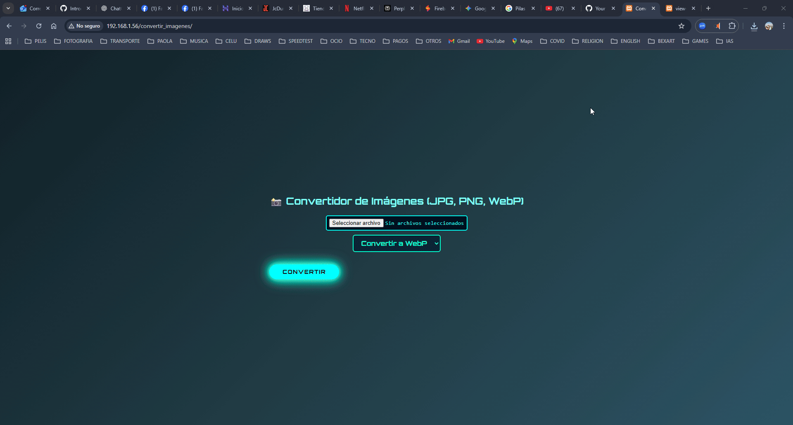

# 🖼️ Convertidor de Imágenes PHP con Soporte WebP
---


## ✨ Descripción

Este proyecto es un script PHP para subir imágenes JPG, PNG o WebP y convertirlas a cualquiera de esos formatos, incluyendo WebP, PNG o JPG, con salida en navegador y opción para descargar la imagen convertida. Tiene una interfaz atractiva con estilo neón y fondo moderno.

## ✨ Vista previa



--- 

## 🧩 Cómo funciona

- Sube una imagen válida (JPG, PNG o WebP).
- Selecciona el formato al que quieres convertir.
- El script procesa la imagen usando la extensión GD de PHP y ¡listo!

---

## ✨ Requisitos importantes para que funcione

### 1. Activar la extensión GD en PHP

El proyecto usa funciones gráficas como `imagecreatefromjpeg()`, `imagepng()`, `imagewebp()`, etc., que provienen de GD, una extensión esencial en PHP para manejar imágenes. Para activarla:

 **Activar extensión GD en PHP:**
   - Abre tu archivo `php.ini` (`C:\xampp\php\php.ini` en XAMPP).
   - Busca la línea:
     ```
     ;extension=gd
     ```
     y elimínale el punto y coma:
     ```
     extension=gd
     ```
   - Guarda y **reinicia Apache** para activar.
     

---

### 2. Confirmar que GD tenga soporte WebP

No basta con activar GD, también tiene que tener soporte para WebP, que es el formato de imagen ultraliviano y moderno.

- Crea un archivo con esto y abre en navegador:

<?php phpinfo(); ?>


- Busca la sección `gd` y allí debe aparecer:
WebP Support enabled

- Si no está habilitado, necesitarás actualizar PHP a una versión que incluya GD con soporte WebP, o usar otro entorno con soporte actualizado.

---

## 📊 Lenguajes y Herramientas

[](https://skillicons.dev)


---

## ✨ Instalación y Uso

1. Instala una pila PHP como XAMPP, WampServer o Laragon (asegúrate que PHP tenga GD y WebP).
2. Coloca el script `index.php` en la carpeta pública (`htdocs` o `www`).
3. Accede desde el navegador a la dirección local, por ejemplo:  
 `http://localhost/convertidor/`
4. Sube tu imagen, elegir el formato y convierte.
5. Puedes descargar la imagen resultante.

---

## ✨ Características del Script

- Acepta imágenes JPG, PNG y WebP.
- Convierte sin perder calidad visual notable (ajustable en configuración).
- Interfaz moderna con CSS neón y fondo degradado.
- Maneja errores básicos y valida tipos de archivo.
- Muestra vista previa y enlace para descargar imagen convertida.

---

## 🧩 Licencia

Proyecto abierto para aprendizaje, uso y modificación libre.

---


